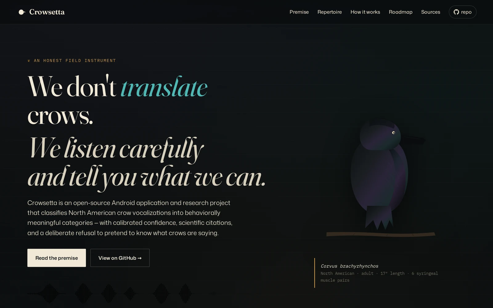

# Crowsetta



> An open-source Android application and research project that classifies
> North American crow vocalizations into behaviorally meaningful categories
> — with calibrated confidence, scientific citations, and a deliberate
> refusal to pretend to know what crows are saying.

🌐 **Site:** [GitHub Pages site](./docs/index.html) — preview locally by opening `docs/index.html`, or enable GitHub Pages on this repo (instructions below).

📚 **Planning:** Full research and design document at [`research/PLANNING.md`](./research/PLANNING.md).

⚠️ **Status:** Class project / MVP scaffold. No model is trained yet. The site, repo structure, and research are complete; implementation is the next phase.

---

## What this is

A semester-scale class project to build an Android app that:

1. Captures audio via the device microphone
2. Detects whether a North American crow is present
3. Classifies the call into one of seven well-attested behavioral categories
   (Territorial Caw · Alarm/Mobbing · Assembly · Scold · Beg/Juvenile · Rattle/Knock · Food/Short)
4. Surfaces a primary plain-English interpretation plus a "deeper dive" pane
   with the spectrogram, top-5 probabilities, and citations linked to the
   canonical papers
5. When a call is unfamiliar, prompts the user to record sensor-rich
   behavioral context (camera, GPS, accelerometer, weather, structured tags)
   so it lands in a research-quality observation log

What it deliberately does **not** do — translate crow calls to English,
claim that "three caws means danger," or pretend to a confidence the
underlying science does not support — is documented in
[`research/HONEST-LIMITS.md`](./research/HONEST-LIMITS.md) and on the site.

---

## Repo structure

```
crow-translator/
├── docs/                  → GitHub Pages site (HTML / CSS / SVG / JS)
│   ├── index.html
│   └── assets/
│       ├── css/style.css
│       ├── js/main.js
│       └── img/           → custom SVG illustrations & favicon
├── research/              → planning, taxonomy, dataset inventory, caveats
│   ├── PLANNING.md        → the master research document
│   ├── TAXONOMY.md        → the seven call types (frozen until model is trained)
│   ├── DATASETS.md        → corpus inventory, licensing, assembly recipe
│   └── HONEST-LIMITS.md   → what the project cannot credibly claim
├── ml/                    → Python pipeline (training, evaluation, export)
│   ├── README.md
│   ├── requirements.txt
│   ├── notebooks/
│   ├── scripts/
│   └── models/
├── android/               → Kotlin / Jetpack Compose app source
│   └── README.md
├── data/                  → labeled audio (gitignored — too large for git)
├── LICENSE
└── README.md
```

---

## Enabling the GitHub Pages site

After pushing this repo to GitHub:

1. Go to **Settings → Pages**
2. Under **Source**, select **Deploy from a branch**
3. Choose branch **`main`** and folder **`/docs`**
4. Click **Save**

The site will be live at `https://<your-username>.github.io/<repo-name>/` within a minute or so.

No build step, no Jekyll, no GitHub Actions — just static HTML/CSS/SVG served from `/docs`.

### Renaming "Crowsetta"

The working name is a placeholder. To rename it, find-and-replace
`Crowsetta` (case-sensitive) across these files:

```
docs/index.html
README.md
research/PLANNING.md
```

There are no other occurrences elsewhere in the codebase.

---

## Local preview

```bash
# From the repo root, just open the file directly:
open docs/index.html         # macOS
xdg-open docs/index.html     # Linux

# Or run a tiny local server (avoids file:// quirks with some browsers):
python3 -m http.server --directory docs 8000
# then visit http://localhost:8000
```

---

## License

- **Code** in this repository: [MIT](./LICENSE)
- **Site copy and SVG illustrations** in `docs/`: MIT (same license as code)
- **When BirdNET-Lite weights are bundled into the Android app**, that bundled artifact inherits BirdNET's CC-BY-NC-SA 4.0 — non-commercial only. This is fine for a class project and for sideloaded APK distribution; it is not fine for commercial Play Store distribution. Perch 2.0 weights, if used instead, are under more permissive Apache-2.0-family terms — see Google's model card.
- **Audio data** sourced from Xeno-canto inherits its per-recording CC license; clips marked `-ND` are not used because training requires derivative works (segmentation, augmentation).

---

## Acknowledgments

This project stands on the work of Kevin McGowan and Carolee Caffrey at
Cornell, John Marzluff and Loma Pendergraft at the University of
Washington, Anne Clark at Binghamton, Kaeli Swift's running synthesis at
*corvidresearch.blog*, the BirdNET team at the K. Lisa Yang Center for
Conservation Bioacoustics, and the Perch team at Google DeepMind / Google
Research. Detailed citations are in [`research/PLANNING.md`](./research/PLANNING.md)
and on the project site.

We are not affiliated with any of them. We just stand on their work.
